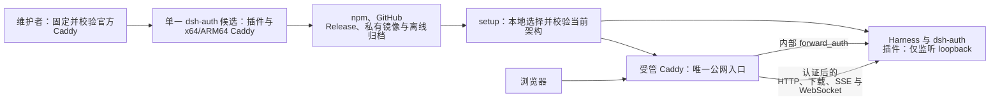
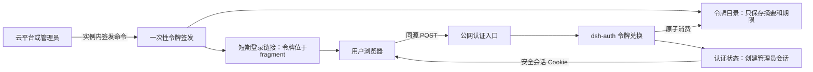

# Epic：一次性令牌登录与企业版 v2

## 愿景

云托管商确认用户拥有实例后，可以在实例内签发短期登录链接。用户一次点击即可安全换取管理员会话，不需要由云平台保存实例密码。首次令牌登录还能建立管理员用户名和密码，后续既可继续从控制台免密登录，也可使用管理员密码登录。

动态状态统一见[《项目进展》](../项目进展.md)。

## 全局设计

本 Epic 包含两个独立交付目标。它们共享 dsh-auth 的认证边界和最终发布验收，但一个目标不是另一个目标的实现步骤。

**能力一：用项目内置 Caddy 取代对用户 Nginx 的依赖。**

用户只管理一个 `dsh-auth` 发布物。维护者从固定官方输入制作自包含候选，并将同一份候选用于 npm、GitHub Release、私有镜像和离线归档。setup 不下载 Caddy，也不探测或接管用户已有网关。

Caddy 负责 TLS、公网请求边界、反向代理和实时连接。dsh-auth 插件继续负责认证策略。Harness 只监听 loopback，绕过 Caddy 的公网路径不在支持边界内。

**能力二：增加一次性令牌登录。**

云平台确认用户有权访问实例后，通过实例内命令签发短期链接。浏览器只把令牌放在 URL fragment 中，再通过同源 POST 原子兑换正常管理员会话。这个能力不要求云平台保存实例密码。

令牌签发、兑换和会话状态由 dsh-auth 负责。公网认证入口只转发请求，不读取令牌目录，也不决定令牌是否有效。

## 成功标准

| 门禁 | Epic 成功条件 |
| --- | --- |
| READY：可以开工 | 最新 Harness 已固定并验证；已提交代码基线、v2 接口、安全边界和执行卡一致 |
| COMPONENT：各部分完成 | 认证状态、Caddy、安装器、令牌签发、令牌兑换和管理员初始化六个结果各自通过行为与质量检查 |
| RELEASE：可以发布 | 一个可独立安装的主包同时包含两种架构 Caddy，并在最新 Harness 上通过真实 E2E、离线安装、秘密扫描、重装和回退验收 |

## Story 地图

| Story | 交付结果 | 门禁 | 依赖 |
| --- | --- | --- | --- |
| [STORY-01 建立统一管理员认证状态](../stories/Story-01-建立统一管理员认证状态.md) | 固定管理员身份、凭据和会话使用同一持久状态 | READY | 无 |
| [STORY-01.1 验证并冻结内置 Caddy](../stories/Story-01.1-验证并冻结内置Caddy.md) | 标准 Caddy 满足认证边界、实时连接和性能门槛 | COMPONENT | STORY-01 |
| [STORY-02 建立企业版 v2 安装契约](../stories/Story-02-建立企业版v2安装契约.md) | setup、受管 Caddy、路径和运维命令使用 v2 契约 | COMPONENT | STORY-01.1 |
| [STORY-03 交付一次性令牌签发](../stories/Story-03-交付一次性令牌签发.md) | systemd 与容器可安全签发短期登录链接 | COMPONENT | STORY-02 |
| [STORY-04 交付一次性令牌兑换](../stories/Story-04-交付一次性令牌兑换.md) | 浏览器安全、原子地换取正常管理员会话 | COMPONENT | STORY-03 |
| [STORY-05 交付管理员首次初始化](../stories/Story-05-交付管理员首次初始化.md) | 用户可设置管理员凭据或选择 Later | COMPONENT | STORY-04 |
| [STORY-06 完成企业版发布验收](../stories/Story-06-完成企业版发布验收.md) | 一个自包含主包和一个 Release 满足安装、安全与发布条件 | RELEASE | STORY-05 |

## 项目边界

- 管理员内部 ID 和角色固定为 `admin`；本期不实现普通用户。
- 密码初始化和令牌初始化是显式二选一；令牌能力启用后长期保留。
- 令牌会话与密码会话共用现有 72 小时滚动策略和安全 Cookie。
- 不实现浏览器内修改既有密码、云厂商用户映射、审计后台或旧版自动迁移。
- 自定义失败文案只支持纯文本，不支持 HTML、品牌组件或外部链接。
- 根 README 仍只面向公共安装和运维，不承载本项目动态状态。

## 权威文档

| 主题 | 文档 |
| --- | --- |
| 动态状态和阻塞 | [项目进展](../项目进展.md) |
| 用户目标和非目标 | [用户需求](../agent/用户需求.md) |
| 不可变架构选择 | [核心决策](../agent/核心决策.md) |
| CLI、配置、状态和 HTTP 契约 | [接口与参数契约](../agent/接口与参数契约.md) |
| 威胁、场景和验收证据 | [安全威胁与验收矩阵](../agent/安全威胁与验收矩阵.md) |
| 门禁授权 | [门禁](../agent/门禁.md) |
